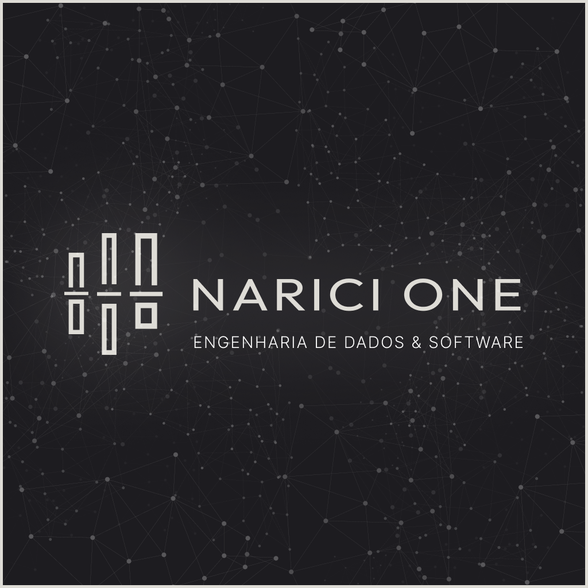

  

  # NARICI ONE
  ### Intelligence & Engineering

  

    <b>Engenharia de Dados com Rigor de Software.</b> 
    Soluções em Data Warehouse, Clean Architecture e Automação para setores críticos.
  

  

    <a href="https://naricione.com">🌐 Website Oficial</a> •
    <a href="https://linkedin.com/company/narici-one">💼 LinkedIn</a> •
    <a href="mailto:naricione@gmail.com">📧 Contato</a>
  

 

## 💎 A Essência

A **Narici One** é uma consultoria boutique que funde a disciplina da Engenharia de Software com a complexidade da Engenharia de Dados. Não entregamos apenas pipelines; construímos ecossistemas digitais resilientes, auditáveis e escaláveis.

Nossa abordagem elimina o "caos de dados" através de arquiteturas maduras (Medallion, Data Mesh) e rigor técnico (Clean Code, TDD, CI/CD).

---

## 🛠️ Tech Stack & Expertise

Somos agnósticos, mas opinativos. Escolhemos ferramentas que oferecem robustez e longevidade.

   
  
   
   

### Domínios de Atuação

| 🏛️ Engenharia de Dados | 🏗️ Arquitetura de Software | 🤖 Automação Inteligente |
| :--- | :--- | :--- |
| • Data Warehousing & Lakes • Pipelines ETL/ELT Resilientes • Modelagem Dimensional (Kimball) • Governança & Qualidade | • Clean Architecture & DDD • Microsserviços & Event-Driven • APIs de Alta Performance • Sistemas Distribuídos | • RPA & Workflow Automation • Integração de LLMs (AI Eng) • Otimização de Processos • Infraestrutura como Código |

---

## 🏗️ Projetos em Destaque

Nossa presença digital pública reflete nossa identidade: **sóbria, precisa e performática**.

*   **[Landing Page Institucional](https://github.com/narici-one/landing-page)**: Nossa vitrine digital construída com React 19, TypeScript e Tailwind.

---

  

    © 2026 <b>Narici One</b>. Ruan Narici Mendonça Consultoria em Tecnologia LTDA. 
    <i>Building the invisible infrastructure of the future.</i>
  

  
  

    
    
  

